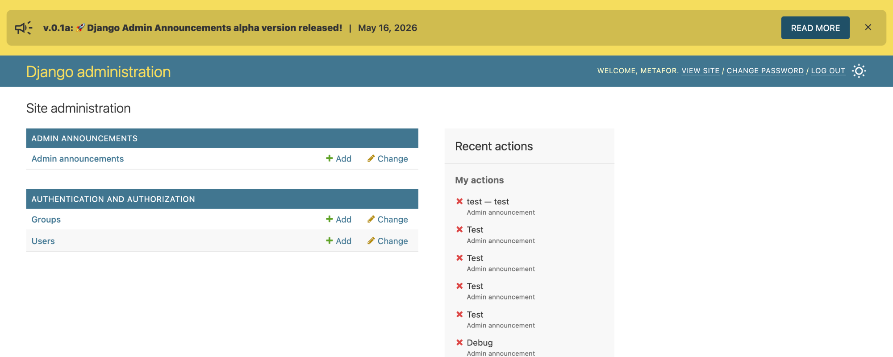
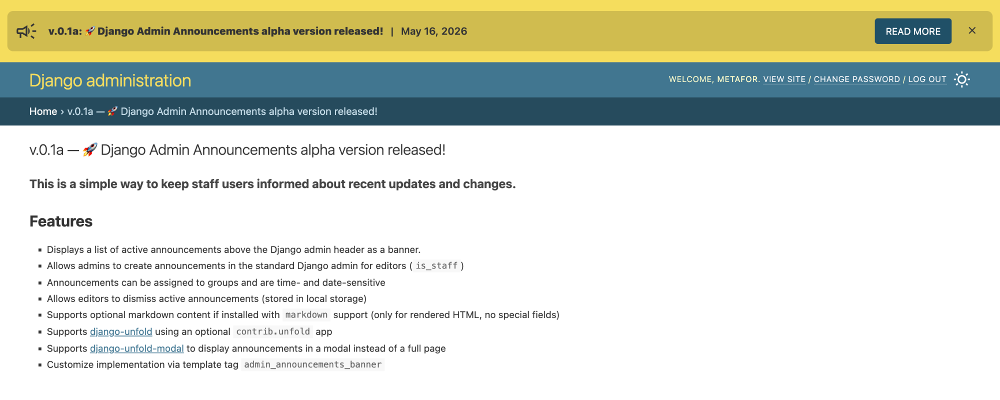
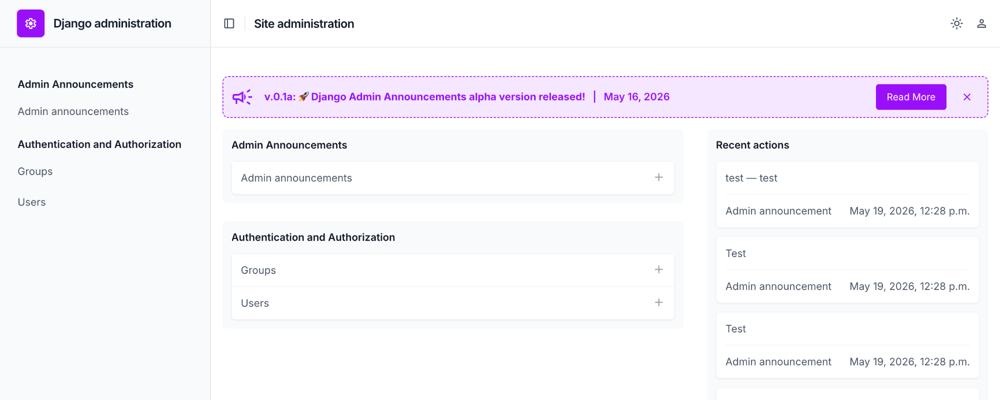
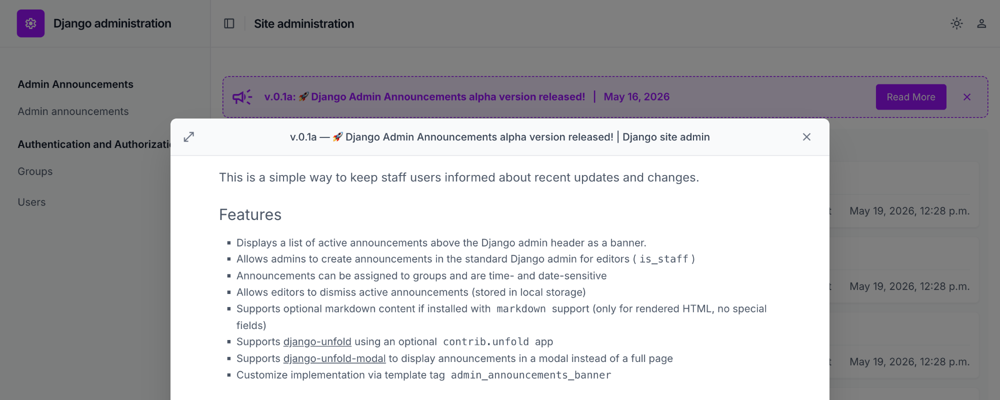

# django-admin-announcements
[](https://pypi.org/project/django-admin-announcements/) [](https://github.com/metaforx/django-admin-announcements/actions/workflows/ci.yml)

Admin announcements for Django, with optional [django-unfold](https://github.com/unfoldadmin/django-unfold) layout integration.

> **Status:** Testing. Beta Release.

## Features

- Displays a list of active announcements above the Django admin header as a banner.
- Allows admins to create announcements in the standard Django admin for editors (`is_staff`)
- Announcements can be assigned to groups and are time- and date-sensitive
- Allows editors to dismiss active announcements (stored in localStorage under `djangoAdminAnnouncements`)
- Supports optional Markdown content if installed with `markdown` support (only for rendered HTML, no special fields)
- Supports [django-unfold](https://github.com/unfoldadmin/django-unfold) using an optional `contrib.unfold` app
- Supports [django-unfold-modal](https://github.com/metaforx/django-unfold-modal) to display announcements in a modal instead of a full page
- Customize implementation via template tag `admin_announcements_banner`
- Supports installed admin themes, custom colors, and dark mode.

## Requirements

- Python 3.10+
- Django 5.0+
- (Optional) django-unfold 0.52.0+ for the `contrib.unfold` integration

## Markdown support
- If installed with `markdown` support, announcements can contain Markdown and will be rendered as HTML.
- [nh3](https://github.com/messense/nh3) is used to sanitize HTML and prevent XSS.
- [concrete.css](https://github.com/louismerlin/concrete.css) (3kb) is used for Markdown styling.

## Screenshots

| Django admin                                                                   | Django admin detail                                                           |
|--------------------------------------------------------------------------------|-------------------------------------------------------------------------------|
|  |  |

| Unfold admin                                                                       | Unfold admin detail                                                               |
|------------------------------------------------------------------------------------|-----------------------------------------------------------------------------------|
|  |  |

## Installation

```bash
pip install django-admin-announcements
```

Install with Markdown rendering support:

```bash
pip install "django-admin-announcements[markdown]"
```

Install with Markdown, Unfold, and Unfold Modal support:

```bash
pip install "django-admin-announcements[markdown,unfold,unfold-modal]"
```


Add to `INSTALLED_APPS`:

```python
INSTALLED_APPS = [
    # ...
    "admin_announcements",
    "django.contrib.admin",
    # ...
]
```

For Unfold integration, also add the contrib app:

```python
INSTALLED_APPS = [
    "admin_announcements.contrib.unfold",
    "unfold",
    "unfold_modal",  # Optional: enables modal announcement detail links.
    "admin_announcements",
    "django.contrib.admin",
    # ...
]
```

Keep `admin_announcements.contrib.unfold` before `unfold` so its Unfold-aware
admin template override is discovered first.

To open announcement detail links in an Unfold modal, also install the
`unfold-modal` extra and load `django-unfold-modal` assets in your Unfold
settings:

```bash
uv sync --extra unfold --extra unfold-modal --group test --group dev
```

```python
from unfold_modal.utils import get_modal_scripts, get_modal_styles

UNFOLD = {
    # ...
    "STYLES": [*get_modal_styles()],
    "SCRIPTS": [*get_modal_scripts()],
}
```

Without `django-unfold-modal` scripts, the links fall back to normal detail pages.

## Custom template integration

If your project already overrides the default Django admin or Unfold templates, add
the announcement assets and template tag to your custom template.

For the stock Django admin, extend your custom `admin/base_site.html` like this:

```html




{{ block.super }}
<link rel="stylesheet" href="">



{{ block.super }}
<script src=""></script>




{{ block.super }}

```

For Unfold, load the assets through `UNFOLD` settings instead of template
blocks. If you are not using `django-unfold-modal`, omit the modal imports and
the `*get_modal_*()` entries.

```python
from django.templatetags.static import static
from unfold_modal.utils import get_modal_scripts, get_modal_styles

UNFOLD = {
    # ...
    "STYLES": [
        lambda request: static("admin_announcements/css/announcements.css"),
        *get_modal_styles(),
    ],
    "SCRIPTS": [
        lambda request: static("admin_announcements/js/announcements.js"),
        *get_modal_scripts(),
    ],
}
```

Then render the banner inside a `.unfold` container so it inherits Unfold layout
spacing and color variables:

```html





    <div class="unfold">
        
    </div>

{{ block.super }}

```

Run migrations:

```bash
python manage.py migrate admin_announcements
```

## Local Development

Install dependencies:

```bash
uv sync --group test --group dev
npm ci
```

Install pre-commit hooks:

```bash
uv run pre-commit install
```

Run all pre-commit hooks manually:

```bash
uv run pre-commit run --all-files
```

Run the stock Django test server:

```bash
uv run tests/server/manage.py runserver 8080
```

Run the Unfold test server:

```bash
uv run --extra unfold tests/server/manage.py runserver 8080 --settings=testapp.settings_unfold
```

## License

MIT
